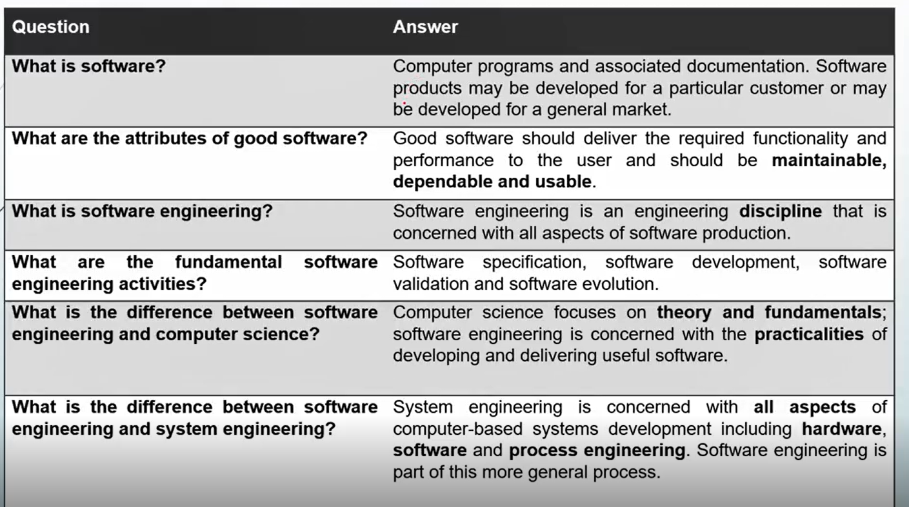

# Software Engineering

## Lecture 1 (Week 1) - Software Engineering Introduction

- **Software** cost is often greater than **Hardware** cost
- **Maintanance** often costs more than **Development**

### Definition

- Software Engineering is **everything you need** to produce successful software since early stages of specifications into maintaining after deployment

### Importance

- Includes **techniques for avoiding many drawbacks** that could leed project to failure, Insures final project is effective, usable and maintainable.
- Gives flexibility to make changes to meet **unexpected** demands without completly destroying your old **schedule** and **budget**

### Types of Software Products

- **General Products:** stand-alone system sold to any customer who wishes to use them
- **Customized Products:** system for a specific client to fit their needs

### Common Issues With Software

- **Heteroginity:** Systems are required to operate as distributed systems across networks that include different unique devices
- **Bussines and Social Change:** there's always changes and technology should be able to keep up with all the needed updates
- **Secuirity and Trust:** Software is included in all of our lives, we need to make sure we can trust it

### General Knowledge

### Attributes of Good Software

- **Maintainabilit:** Should be written in a way to evolve and meet changing needs of customers
- **Dependability and Security:** Doesn't go down often and shouldn't harm hardware on failure
- **Efficiency:** Doesn't use too much computer resources
- **Acceptability:** the user it's designed for should be able to use it

### Application Types

- **Stand-Alone:** run on local computers, don't need a network
- **Interactive Transaction-based:** Execute on remote computers and are accesable, like webapps
- **Embedded Control:** Software control systems that control and manage hardware devices
- **Batch Proessing:** business sytems that are designed to process data in large batches
- **Entertainment:** Intended to entertain the users, example are games
- **Modelling and Simulation:** used by scientists and engineers to model physical proccesses or situtations
- **Data Collection:** collect data from environment using set of sensors and send data to other systems for proccessing
- **System of systems:** Collection of other systems

### Key Roles in Software Engireering

- **Software Developer:**
  - Write, test, and maintain code
  - Collaborate with designers, testers, and product owner
  - Specializations: frontend, backend, full-stack, mobile, embedded
- **Product Owner:** (Worst People)
  - Defines project vision and objectives
  - communicates requirements and priorities to team
  - Balance business goals with user needs
- **UX/UI Designer:**
  - Design intuitive interfaaces
  - helps implement design with devs
- **Quality Assurance (QA):**
  - Develops and executes test plans
  - Ensures software meets requirements and standards
  - works with devs to resolve issues
- **DevOps Specialist:**
  - Automate deployment and ifrastrucre management
  - Implement CI/CD pipelines
  - work with devs to streamline releases