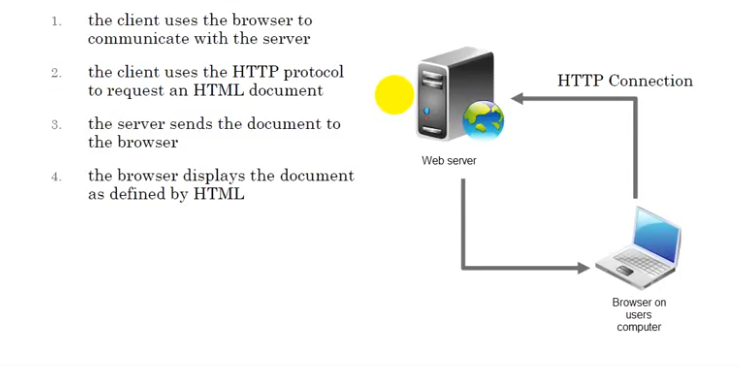
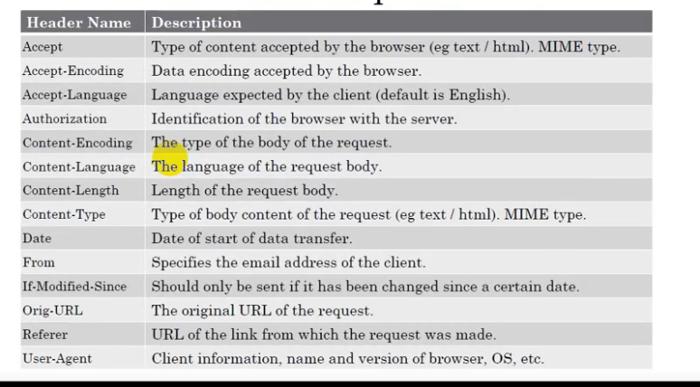
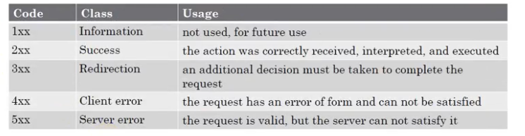

# Server-side Web Development - Week 1

## Prequisites

- HTML, CSS, JS
- Programming basics
- Database knowledge

## Chapter1: Web Architecture

- Web: network app based on TCP/IP
- Clients: software, browsers
- web server listens on port 80
- dialogue between client and cerver is defined by the protocol **HTTP**

### URL (Uniform Resource Locators)

Specifies:

- the used protocol
- the adress of the server publishing the documents
- the path to access the docs on the server
- aditional informations

  - **Relative URL:** on the same server https://google and move into /about-us
  - **Absolute URL:** rewrite whole url
  
### HTTP Protocol

- protocol used by the web
- headers describing content of message
- uses MIME for encoding
- it's for file transfer and contact between web and client

### MIME

- standard protocol for Mails
- allows mail to have headers, etc...
- allos mail to have attachments (image, sound, ...)

### Classic Scenario of web

### HTTP Requests

sets of lines having:

- a query line with:
  - the method
  - the url
  - the protocol version
- header fields of query:
  - set of optional lines
  - name
  - additional info about request or client
- body of request:
  - set of optional lines
  - allows for sending POST command data

Usually we care about URL, method, and body
example post login request:

- url: https://mywebsite/login
- method: post
- body: {"name": "hussein", "password": "hussein123"}

#### Useful Methods

- GET: query of the resource located at URL, basically return a certain page
- HEAD: same as get but without a body. I have NEVER used it
- POST: sending data to a program at specified URL usually to request an operation, like the login example
- PUT: sending data to a program like post. Post is usually for Create commands while PUT is for udpating a certain data
- DELETE: delete a certain resource at url, deleting account for example, doesn't contain body

#### Usefull Request Headers

Note that IRL I've only ever had to use a few, usually they're rare to manually set. common ones to use are Authorization, Content-Type...

### HTTP Response

- After a server recieves a request it analyzes and returns a responce, usually responce has a status line, headers, and body
- for a GET method, you return HTML requested, for a POST method, you return the result of the opertion requested

### HTTP Error codes

### Personal Examples

- we have a website
- We send a GET request (by searching in the field) with url https://website/login, the response has error code 200 (Succesful) and returns HTML for us to render
- now that we have a page, we fill the form with info and press submit, the browser sends a POST request to url https://website/login, the body has data filled in form. if the user isn't found server return 404, if login success the server returns 200, if server crashed we return 500

## Dynamic Web Applications

- Classic HTML often isn't enough, we need interactivity
- 2 techniques: code execute on client (on web), code execute on server
- PHP executes on the server

### Client-side execution

- Advantages:
  - server has less work
  - network traffic reduced
- Disadvantage:
  - not all computers for clients are same
  - Secuirity problems
- REALLY hard to build a big app with code running on clients
- PHP is a language to build servers to avoid client side execution

### PHP Development Process

1. Create PHP script and save to local disk
2. Use FTP to copy file to server
3. access file using a browser